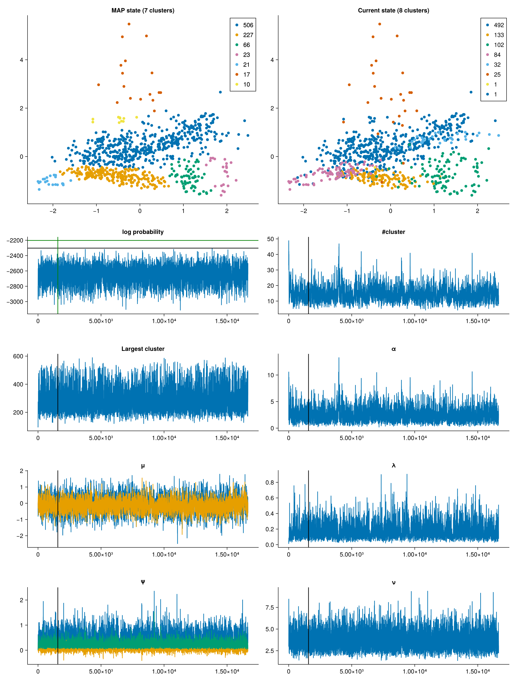
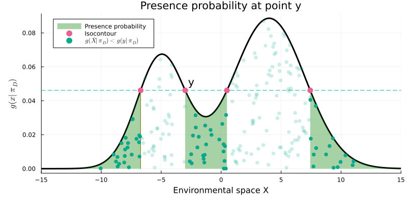

# FlowingClusters.jl

FlowingClusters.jl performs unsupervised clustering of arbitrary real data that have first been deformed into a base space under a FFJORD normalizing flow ([Grathwohl et al. 2018](https://arxiv.org/abs/1810.01367)).

## Generative model
The generative model in the base space consists of a non-parametric Chinese Restaurant Process (CRP) prior ([Pitman 1995](https://doi.org/10.1007%2FBF01213386), [Aldous 1985](https://doi.org/10.1007%2FBFb0099421), [Frigyik et al. 2010 Tutorial](https://web.archive.org/web/20190327085650/https://pdfs.semanticscholar.org/775e/5727f5df0cb9bf834af2ea2548a696c27a38.pdf)). The base distribution of the CRP is given by a [normal-inverse-Wishart distribution](https://en.wikipedia.org/wiki/Normal-inverse-Wishart_distribution) and the data likelihood by multivariate normal. For the hyperprior for the parameters of the normal-inverse-Wishart distribution and the CRP prior we use an independence Jeffreys prior. The generative model $p(\mathbf{z})$ for $N$ $d$-dimensional data points $z_j$ is given by
```math
\begin{align*}
\alpha & & \quad\sim\quad & \sqrt{(\psi(\alpha + N) - \psi(\alpha))/\alpha + \psi'(\alpha +N) - \psi'(\alpha)}, \\
\mu_0 & & \quad\sim\quad & 1, \\
\lambda_0 & & \quad\sim\quad & 1/\lambda_0, \\
\Psi_0 & & \quad\sim\quad & \left\vert\Psi_0\right\vert^{-d} \\
\nu_0 & & \quad\sim\quad & \sqrt{{\textstyle\sum}_{i=1}^d \psi'(\nu_0/2 + (1 - i)/2)}, \\
\pi~\vert~ & \alpha & \quad\sim\quad & \text{CRP}(\alpha), \\
\mu_\omega, \Sigma_\omega~\vert~ & \pi,\mu_0, \lambda_0, \Psi_0, \nu_0 & \quad\sim\quad & \text{NIW}(\mu_0, \lambda_0, \Psi_0, \nu_0), \qquad \omega\in\pi,\\
z_j~\vert~ & \omega, \mu_\omega, \Sigma_\omega & \quad\sim\quad & \text{MvNormal}(\mu_\omega, \Sigma_\omega), \qquad j\in\omega.
\end{align*}
```
If a neural network $f(z)$ with input and output dimension $d$ is provided, the generative model is modified according to the FFJORD
```math
\log p_\mathbf{x}(\mathbf{x}) = \log p_\mathbf{z}(\mathbf{z}) - \sum_{i=1}^N \int_0^1 \text{tr}\frac{\partial f(z_j(t))}{z_j(t)}dt
```
where $x_j = z_j(1)$ and $z_j = z_j(0)$. The generative model $p(\mathbf{x})$ of the data in real space becomes a deformation of the unsupervised clustering generative model $p(\mathbf{z})$ in the base space. We choose an isotropic location-scale $t$ distribution prior over the weights of the last hidden layer (Neal 1996 _Bayesian Learning for Neural Networks_)
```math
w_{ij}\quad\sim\quad lst(0, W^2, \nu)
```
where $W$ is the number of weights of this last hidden layer and the index $\nu=0.01$ approaching the logarithmic prior.

We use Adaptive-Metropolis-within-Gibbs (AMWG) for the hyperparameters of the clustering part of the model, and Adaptive-Metropolis (AM) for the parameters of the neural network. The Chinese Restaurant Process is sampled using a mix of both traditional Gibbs moves ([Neal 2000 Algorithm 1](https://doi.org/10.2307/1390653)) and sequentially allocated split-merge proposals ([Dahl & Newcomb 2022](https://doi.org/10.1080/00949655.2021.1998502)).


## Usage
#### Without FFJORD
```julia
using FlowingClusters
using SplitMaskStandardize

dataset = SMSDataset("data/ebird_data/ebird_bioclim_landcover.csv", splits=[1, 1, 1], subsample=3000)
chain = MNCRPChain(eb.training.presence(:sp1).standardize(:BIO1, :BIO12), nb_samples=200)
advance_chain!(chain, Inf, nb_splitmerge=150, nb_hyperparams=2)
```

```
Progress:  64    Time: 0:00:17 ( 0.27  s/it)
  step (hyperparams per, gibbs per, splitmerge per):       64/Inf (2, 1, 150.0)
  chain length:                                            5146
  conv largestcluster chain (burn 50%):                    ess=386.3, rhat=1.0
  #chain samples (oldest, latest, eta) convergence:        108/200 (3678, 5140, 8) ess=85.3 rhat=0.999 (trim if ess<72.0)
  logprob (max, q95, max minus nn):                        -2603.6 (-2315.1, -2463.2, -2315.1)
  nb clusters, nb>1, smallest(>1), median, mean, largest:  11, 9, 2, 42.0, 79.0, 262
  split #succ/#tot, merge #succ/#tot:                      2/30, 1/117
  split/step, merge/step:                                  4.83, 4.75
  MAP #attempts/#successes:                                5/0
  nb clusters, nb>1, smallest(>1), median, mean, largest:  7, 7, 10, 23.0, 124.0, 506
  last MAP logprob (minus nn):                             -2202.3 (-2202.3)
  last MAP at:                                             1572
  last checkpoint at:                                      -1
```

Here we save a sample of the state of the chain in a buffer of size 200. This is done each time the number of iterations since the last sample crosses over twice the autocorrelation time of the last 50% of the chain of the size of the largest cluster, a typical proxy of mixing used in non-parametric clustering. Once the buffer is full and the ess of the samples is approximately equal to the size of the buffer we stop the chain by invoking `touch stop` in the same working directory. The oldest chain samples are automatically dropped when the ess goes below 50% of the number of samples in the buffer.

### Rules of thumb
- It's ok the stop the chain once the sample buffer is full and its ess is roughly equal to the buffer size.
- Set the number of split-merge `nb_splitmerge` moves per iteration such that the number of accepted splits and merges per iteration is above 3 to prevent overfitting. This is especially important when using a neural network.
- The number of Gibbs moves `nb_gibbs` can be set to 1, and the number `nb_hyperparams` of AMWG and AM moves to 1 or 2.

### Chain output
We can plot the chain which outputs a very approximate MAP state of the clusters (greedy Gibbs plus a partial hyperparameter optimization), the current state of the clusters in the chain, together with the trace of various quantities such as the log-probability, the number of clusters, the size of the largest clusters, and all the hyperparameters.
```julia
plot(chain)
```



We can also get the predictions of tail probabilities (suitability in SDMs, or probability of presence) at a set of test points for a single state of the chain, in this case the approximate MAP state, and statistical summaries of those tail probabilities using the 200 chain samples we've collected.
```julia
tp = tail_probability(chain.map_clusters, chain.map_hyperparams);

tp(dataset.test.presence(:sp1).standardize(:BIO1, :BIO12))
841-element Vector{Float64}:
 0.2255
 0.0671
 0.0004
 ⋮
 0.9112
 0.7221

tpsumm = tail_probability_summary(presence_chain_.clusters_samples, presence_chain_.hyperparams_samples);
summstats = tpsumm(dataset.test.presence(:sp1).standardize(:BIO1, :BIO12))
(median = [0.1604, 0.1793, 0.0013, ⋯], 
 mean = [ ⋯ ],
 std = [ ⋯ ],
 iqr = [ ⋯ ],
 CI95 = [ ⋯ ],
 CI90 = [ ⋯ ],
 quantile = q -> ⋯,
 modefd = [ ⋯ ],
 modedoane = [ ⋯ ])

 # The quantile field is a function that returns the
 # q quantile of the tail probabilities at each points
 # in the dataset
 summstats.quantile(0.3)
 841-element Vector{Float64}:
  0.13695
  0.14554
  0.0009
  ⋮
  0.9115
  0.58434
 ```
The tail probability is a generalization of the way the suitability is determine in BIOCLIM. For a given point $y$ in environmental sapce, it is the mass of probability in regions of that space where the posterior-predictive probability $g(.)$ is equal or less than $g(y)$, i.e. the tail probability below the isocontour at point $y$. Since the posterior-predictive of our generative model is a multivariate $t$-distribution, we can easily calculate it using rejection sampling
$$s(y) = E_X\left[\mathbb{1}_{g(X) \le g(y)}\right] \approx \frac{1}{M}\sum_{i=1}^M \mathbb{1}_{g(X_i) \le g(y)}.$$
